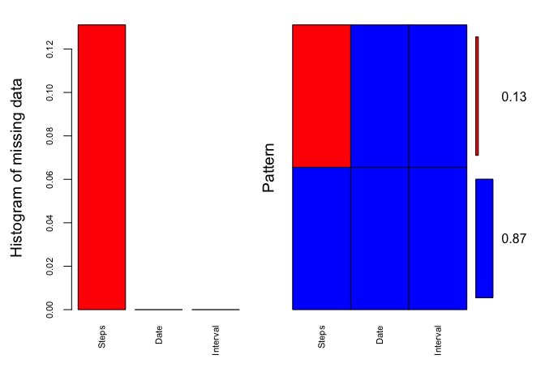

### Introduction 
This is the project for "Reproducible Research: Peer Assessment 1". 

You can find detials on the README file.

We will go through the questions and answer them accordlingly.

### Project details 
#### Loading and preprocessing the data

Code for reading in the dataset and/or processing the data Loading and preprocessing the data

```r
activityData <- read.csv("./activity.csv", skip = 1, sep = ",", col.names = c("Steps", "Date", "Interval"))
```

#### Histogram of the total number of steps taken each day

```r
totalStepsByDay <- aggregate(Steps ~ Date, activityData, sum, na.rm = TRUE)

hist(totalStepsByDay$Steps, xlab = "Total steps taken each day", main = "Histogram of total steps take each day")
```


#### Mean and median number of steps taken each day

##### Mean number of steps taken each day

```r
meanNumberStepsByDay <- aggregate(Steps ~ Date, activityData, mean, na.rm = TRUE)
meanNumberStepsByDay
```

```
##          Date      Steps
## 1  2012-10-02  0.4375000
## 2  2012-10-03 39.4166667
## 3  2012-10-04 42.0694444
## 4  2012-10-05 46.1597222
## 5  2012-10-06 53.5416667
## 6  2012-10-07 38.2465278
## 7  2012-10-09 44.4826389
## 8  2012-10-10 34.3750000
## 9  2012-10-11 35.7777778
## 10 2012-10-12 60.3541667
## 11 2012-10-13 43.1458333
## 12 2012-10-14 52.4236111
## 13 2012-10-15 35.2048611
## 14 2012-10-16 52.3750000
## 15 2012-10-17 46.7083333
## 16 2012-10-18 34.9166667
## 17 2012-10-19 41.0729167
## 18 2012-10-20 36.0937500
## 19 2012-10-21 30.6284722
## 20 2012-10-22 46.7361111
## 21 2012-10-23 30.9652778
## 22 2012-10-24 29.0104167
## 23 2012-10-25  8.6527778
## 24 2012-10-26 23.5347222
## 25 2012-10-27 35.1354167
## 26 2012-10-28 39.7847222
## 27 2012-10-29 17.4236111
## 28 2012-10-30 34.0937500
## 29 2012-10-31 53.5208333
## 30 2012-11-02 36.8055556
## 31 2012-11-03 36.7048611
## 32 2012-11-05 36.2465278
## 33 2012-11-06 28.9375000
## 34 2012-11-07 44.7326389
## 35 2012-11-08 11.1770833
## 36 2012-11-11 43.7777778
## 37 2012-11-12 37.3784722
## 38 2012-11-13 25.4722222
## 39 2012-11-15  0.1423611
## 40 2012-11-16 18.8923611
## 41 2012-11-17 49.7881944
## 42 2012-11-18 52.4652778
## 43 2012-11-19 30.6979167
## 44 2012-11-20 15.5277778
## 45 2012-11-21 44.3993056
## 46 2012-11-22 70.9270833
## 47 2012-11-23 73.5902778
## 48 2012-11-24 50.2708333
## 49 2012-11-25 41.0902778
## 50 2012-11-26 38.7569444
## 51 2012-11-27 47.3819444
## 52 2012-11-28 35.3576389
## 53 2012-11-29 24.4687500
```

##### Mean number of steps taken each day excluding 0 

```r
noZeroMean <- function(x) {
    if (all(x==0)) 0 else mean(x[x!=0])
}
meanNumberWithoutZeroStepsByDay <- aggregate(Steps ~ Date, activityData, noZeroMean)
meanNumberWithoutZeroStepsByDay
```

```
##          Date     Steps
## 1  2012-10-02  63.00000
## 2  2012-10-03 140.14815
## 3  2012-10-04 121.16000
## 4  2012-10-05 154.58140
## 5  2012-10-06 145.47170
## 6  2012-10-07 101.99074
## 7  2012-10-09 134.85263
## 8  2012-10-10  95.19231
## 9  2012-10-11 137.38667
## 10 2012-10-12 156.59459
## 11 2012-10-13 119.48077
## 12 2012-10-14 160.61702
## 13 2012-10-15 131.67532
## 14 2012-10-16 157.12500
## 15 2012-10-17 152.86364
## 16 2012-10-18 152.36364
## 17 2012-10-19 127.19355
## 18 2012-10-20 125.24096
## 19 2012-10-21  96.93407
## 20 2012-10-22 154.71264
## 21 2012-10-23 101.34091
## 22 2012-10-24 104.43750
## 23 2012-10-25  56.63636
## 24 2012-10-26  77.02273
## 25 2012-10-27 134.92000
## 26 2012-10-28 110.17308
## 27 2012-10-29  80.93548
## 28 2012-10-30 110.32584
## 29 2012-10-31 179.23256
## 30 2012-11-02 143.24324
## 31 2012-11-03 117.45556
## 32 2012-11-05 141.06757
## 33 2012-11-06 100.40964
## 34 2012-11-07 135.61053
## 35 2012-11-08  61.90385
## 36 2012-11-11 132.71579
## 37 2012-11-12 156.01449
## 38 2012-11-13  90.56790
## 39 2012-11-15  20.50000
## 40 2012-11-16  89.19672
## 41 2012-11-17 183.83333
## 42 2012-11-18 162.47312
## 43 2012-11-19 117.88000
## 44 2012-11-20  95.14894
## 45 2012-11-21 188.04412
## 46 2012-11-22 177.62609
## 47 2012-11-23 252.30952
## 48 2012-11-24 176.56098
## 49 2012-11-25 140.88095
## 50 2012-11-26 128.29885
## 51 2012-11-27 158.67442
## 52 2012-11-28 212.14583
## 53 2012-11-29 110.10938
```

##### Median number of steps taken each day

```r
medianNumberStepsByDay <- aggregate(Steps ~ Date, activityData, median, na.rm = TRUE)
medianNumberStepsByDay
```

```
##          Date Steps
## 1  2012-10-02     0
## 2  2012-10-03     0
## 3  2012-10-04     0
## 4  2012-10-05     0
## 5  2012-10-06     0
## 6  2012-10-07     0
## 7  2012-10-09     0
## 8  2012-10-10     0
## 9  2012-10-11     0
## 10 2012-10-12     0
## 11 2012-10-13     0
## 12 2012-10-14     0
## 13 2012-10-15     0
## 14 2012-10-16     0
## 15 2012-10-17     0
## 16 2012-10-18     0
## 17 2012-10-19     0
## 18 2012-10-20     0
## 19 2012-10-21     0
## 20 2012-10-22     0
## 21 2012-10-23     0
## 22 2012-10-24     0
## 23 2012-10-25     0
## 24 2012-10-26     0
## 25 2012-10-27     0
## 26 2012-10-28     0
## 27 2012-10-29     0
## 28 2012-10-30     0
## 29 2012-10-31     0
## 30 2012-11-02     0
## 31 2012-11-03     0
## 32 2012-11-05     0
## 33 2012-11-06     0
## 34 2012-11-07     0
## 35 2012-11-08     0
## 36 2012-11-11     0
## 37 2012-11-12     0
## 38 2012-11-13     0
## 39 2012-11-15     0
## 40 2012-11-16     0
## 41 2012-11-17     0
## 42 2012-11-18     0
## 43 2012-11-19     0
## 44 2012-11-20     0
## 45 2012-11-21     0
## 46 2012-11-22     0
## 47 2012-11-23     0
## 48 2012-11-24     0
## 49 2012-11-25     0
## 50 2012-11-26     0
## 51 2012-11-27     0
## 52 2012-11-28     0
## 53 2012-11-29     0
```

##### Median number of steps taken each day excluding 0

```r
noZeroMedian <- function(x) {
    if (all(x==0)) 0 else median(x[x!=0])
}

medianNumberStepsWithoutZeroByDay <- aggregate(Steps ~ Date, activityData, noZeroMedian)
medianNumberStepsWithoutZeroByDay
```

```
##          Date Steps
## 1  2012-10-02  63.0
## 2  2012-10-03  61.0
## 3  2012-10-04  56.5
## 4  2012-10-05  66.0
## 5  2012-10-06  67.0
## 6  2012-10-07  52.5
## 7  2012-10-09  48.0
## 8  2012-10-10  56.5
## 9  2012-10-11  35.0
## 10 2012-10-12  46.0
## 11 2012-10-13  45.5
## 12 2012-10-14  60.5
## 13 2012-10-15  54.0
## 14 2012-10-16  64.0
## 15 2012-10-17  61.5
## 16 2012-10-18  52.5
## 17 2012-10-19  74.0
## 18 2012-10-20  49.0
## 19 2012-10-21  48.0
## 20 2012-10-22  52.0
## 21 2012-10-23  56.0
## 22 2012-10-24  51.5
## 23 2012-10-25  35.0
## 24 2012-10-26  36.5
## 25 2012-10-27  72.0
## 26 2012-10-28  61.0
## 27 2012-10-29  54.5
## 28 2012-10-30  40.0
## 29 2012-10-31  83.5
## 30 2012-11-02  55.5
## 31 2012-11-03  59.0
## 32 2012-11-05  66.0
## 33 2012-11-06  52.0
## 34 2012-11-07  58.0
## 35 2012-11-08  42.5
## 36 2012-11-11  55.0
## 37 2012-11-12  42.0
## 38 2012-11-13  57.0
## 39 2012-11-15  20.5
## 40 2012-11-16  43.0
## 41 2012-11-17  65.5
## 42 2012-11-18  80.0
## 43 2012-11-19  34.0
## 44 2012-11-20  58.0
## 45 2012-11-21  55.0
## 46 2012-11-22  65.0
## 47 2012-11-23 113.0
## 48 2012-11-24  65.5
## 49 2012-11-25  84.0
## 50 2012-11-26  53.0
## 51 2012-11-27  57.0
## 52 2012-11-28  70.0
## 53 2012-11-29  44.5
```

#### Time series plot of the average number of steps taken

```r
library(ggplot2)
```

```
## Warning: package 'ggplot2' was built under R version 3.2.4
```

```r
## Create plot
g <- qplot(x = Date, y = Steps, data = meanNumberStepsByDay, group = 1)
g + labs(x="Date", y = "Average number of steps") + theme(axis.text.x = element_text(angle = 45, hjust = 1)) + geom_point(color="blue") + geom_line() +  geom_smooth(span = 1)
```


#### The 5-minute interval that, on average, contains the maximum number of steps

##### Get the average number of stteps for each 5 minute interval 

```r
averageStepsOnInterval <- aggregate(Steps ~ Interval, activityData, mean, na.rm = TRUE)
```

##### Find the max number steps

```r
intervalMaxNumberOfSteps <- averageStepsOnInterval$Interval[averageStepsOnInterval$Steps == max(averageStepsOnInterval$Steps)]
intervalMaxNumberOfSteps
```

```
## [1] 835
```

#### Code to describe and show a strategy for imputing missing data

There are two major ways to impute missing data. They are Multiple Imputation and Maximum Likelihood. Maxium Likelihood seems to introduce less bias ot the data compare to multiple imputation. And they deal with different dataset differently such as if the msissing data is ramdom or not. 

##### Let's look at how many missing data there is. 

```r
## Find the missing percentage
missPercentage <- function(x){sum(is.na(x))/length(x)*100}

apply(activityData,2, missPercentage)
```

```
##    Steps     Date Interval 
## 13.10981  0.00000  0.00000
```
For this project, it seems that the missing data for steps is a little more than 13%. Which is larger than recommanded 5%  for maxiumn missing data. So it is best to collect more data for steps. 

For this project, we will use mice package to impute missing steps using Multiple Imputation.

##### Install and include the mice library

```r
## Install.packages("mice")
library(mice)
```

```
## Loading required package: Rcpp
```

```
## Warning: package 'Rcpp' was built under R version 3.2.4
```

```
## mice 2.25 2015-11-09
```

```r
md.pattern(activityData)
```

```
##       Date Interval Steps     
## 15264    1        1     1    0
##  2303    1        1     0    1
##          0        0  2303 2303
```
We can see that there are 2303 rows of data are missing for Steps over 15264 rows.

Another way to look at this is using VIM

Reference used [Imputing missing data with r mice package](http://www.r-bloggers.com/imputing-missing-data-with-r-mice-package/ "R-Bloggers").

##### Install and use VIM, plot the missing part of the data

```r
## Install.packages("VIM")
library(VIM)
```

```
## Loading required package: colorspace
```

```
## Loading required package: grid
```

```
## Loading required package: data.table
```

```
## VIM is ready to use. 
##  Since version 4.0.0 the GUI is in its own package VIMGUI.
## 
##           Please use the package to use the new (and old) GUI.
```

```
## Suggestions and bug-reports can be submitted at: https://github.com/alexkowa/VIM/issues
```

```
## 
## Attaching package: 'VIM'
```

```
## The following object is masked from 'package:datasets':
## 
##     sleep
```

```r
aggr_plot <- aggr(activityData, col=c('blue','red'), numbers=TRUE, sortVars=TRUE, labels=names(activityData), cex.axis=.7, gap=3, ylab=c("Histogram of missing data","Pattern"))
```



```
## 
##  Variables sorted by number of missings: 
##  Variable     Count
##     Steps 0.1310981
##      Date 0.0000000
##  Interval 0.0000000
```
Now, we use mice package to imputate by using predictive mean matching. There are many methods to impute missing data in the package. We are using mice.impute.pmm method here. We can use methods(mice) to see all the methods for impuation.

##### Use Mice to impute the data using PMM method

```r
imputedData <- mice(activityData, maxit=50,meth='pmm', seed=500, printFlag = FALSE)
```
Now to we have 5 sets of data to use for the imputation. Let's pick the third one.


```r
completedImputedData <- complete(imputedData, 3)
```
Now we have a complete data set without missing data. This could introduce data bias. 

#### Histogram of the total number of steps taken each day after missing values are imputed. Get their mean and median nubmer

```r
## Total
totalStepsImputedByDay <- aggregate(Steps ~ Date, completedImputedData, sum)

hist(totalStepsImputedByDay$Steps, xlab = "Total steps taken each day", main = "Histogram of total steps take each day after imputation")
```


```r
## Mean
meanNumberStepsImputedByDay <- aggregate(Steps ~ Date, completedImputedData, mean)
meanNumberStepsImputedByDay
```

```
##          Date      Steps
## 1  2012-10-01 57.8641115
## 2  2012-10-02  0.4375000
## 3  2012-10-03 39.4166667
## 4  2012-10-04 42.0694444
## 5  2012-10-05 46.1597222
## 6  2012-10-06 53.5416667
## 7  2012-10-07 38.2465278
## 8  2012-10-08 54.7777778
## 9  2012-10-09 44.4826389
## 10 2012-10-10 34.3750000
## 11 2012-10-11 35.7777778
## 12 2012-10-12 60.3541667
## 13 2012-10-13 43.1458333
## 14 2012-10-14 52.4236111
## 15 2012-10-15 35.2048611
## 16 2012-10-16 52.3750000
## 17 2012-10-17 46.7083333
## 18 2012-10-18 34.9166667
## 19 2012-10-19 41.0729167
## 20 2012-10-20 36.0937500
## 21 2012-10-21 30.6284722
## 22 2012-10-22 46.7361111
## 23 2012-10-23 30.9652778
## 24 2012-10-24 29.0104167
## 25 2012-10-25  8.6527778
## 26 2012-10-26 23.5347222
## 27 2012-10-27 35.1354167
## 28 2012-10-28 39.7847222
## 29 2012-10-29 17.4236111
## 30 2012-10-30 34.0937500
## 31 2012-10-31 53.5208333
## 32 2012-11-01 53.8194444
## 33 2012-11-02 36.8055556
## 34 2012-11-03 36.7048611
## 35 2012-11-04 61.5034722
## 36 2012-11-05 36.2465278
## 37 2012-11-06 28.9375000
## 38 2012-11-07 44.7326389
## 39 2012-11-08 11.1770833
## 40 2012-11-09 54.2430556
## 41 2012-11-10 66.8888889
## 42 2012-11-11 43.7777778
## 43 2012-11-12 37.3784722
## 44 2012-11-13 25.4722222
## 45 2012-11-14 58.6736111
## 46 2012-11-15  0.1423611
## 47 2012-11-16 18.8923611
## 48 2012-11-17 49.7881944
## 49 2012-11-18 52.4652778
## 50 2012-11-19 30.6979167
## 51 2012-11-20 15.5277778
## 52 2012-11-21 44.3993056
## 53 2012-11-22 70.9270833
## 54 2012-11-23 73.5902778
## 55 2012-11-24 50.2708333
## 56 2012-11-25 41.0902778
## 57 2012-11-26 38.7569444
## 58 2012-11-27 47.3819444
## 59 2012-11-28 35.3576389
## 60 2012-11-29 24.4687500
## 61 2012-11-30 56.3576389
```

```r
## Median
medianNumberStepsImputedByDay <- aggregate(Steps ~ Date, completedImputedData, median)
medianNumberStepsImputedByDay
```

```
##          Date Steps
## 1  2012-10-01     0
## 2  2012-10-02     0
## 3  2012-10-03     0
## 4  2012-10-04     0
## 5  2012-10-05     0
## 6  2012-10-06     0
## 7  2012-10-07     0
## 8  2012-10-08     0
## 9  2012-10-09     0
## 10 2012-10-10     0
## 11 2012-10-11     0
## 12 2012-10-12     0
## 13 2012-10-13     0
## 14 2012-10-14     0
## 15 2012-10-15     0
## 16 2012-10-16     0
## 17 2012-10-17     0
## 18 2012-10-18     0
## 19 2012-10-19     0
## 20 2012-10-20     0
## 21 2012-10-21     0
## 22 2012-10-22     0
## 23 2012-10-23     0
## 24 2012-10-24     0
## 25 2012-10-25     0
## 26 2012-10-26     0
## 27 2012-10-27     0
## 28 2012-10-28     0
## 29 2012-10-29     0
## 30 2012-10-30     0
## 31 2012-10-31     0
## 32 2012-11-01     0
## 33 2012-11-02     0
## 34 2012-11-03     0
## 35 2012-11-04     0
## 36 2012-11-05     0
## 37 2012-11-06     0
## 38 2012-11-07     0
## 39 2012-11-08     0
## 40 2012-11-09     0
## 41 2012-11-10     0
## 42 2012-11-11     0
## 43 2012-11-12     0
## 44 2012-11-13     0
## 45 2012-11-14     0
## 46 2012-11-15     0
## 47 2012-11-16     0
## 48 2012-11-17     0
## 49 2012-11-18     0
## 50 2012-11-19     0
## 51 2012-11-20     0
## 52 2012-11-21     0
## 53 2012-11-22     0
## 54 2012-11-23     0
## 55 2012-11-24     0
## 56 2012-11-25     0
## 57 2012-11-26     0
## 58 2012-11-27     0
## 59 2012-11-28     0
## 60 2012-11-29     0
## 61 2012-11-30     0
```

#### Panel plot comparing the average number of steps taken per 5-minute interval across weekdays and weekends

```r
library(timeDate)

## Add a column for if the date is weekday or not
completedImputedData$WeekDay <- isWeekday(completedImputedData$Date, wday=1:5)

## Give the column values as factor of either Weekday or Weekend
completedImputedData$WeekDay <- factor(completedImputedData$WeekDay, labels = c("Weekday", "Weekend"))
 
## Aggregate data to have the average number of steps take per 5 minutes on all days.
completeIntervalData <- aggregate(Steps ~ Interval + WeekDay, completedImputedData, mean)

## Plot data user facets by factor WeekDay
myPlot <- qplot(Interval, Steps, data=completeIntervalData, shape=WeekDay, color=WeekDay, facets = (WeekDay~ .), xlab="Interval", ylab="Average Steps") 

myPlot + geom_line() + geom_smooth(method = "lm", se = TRUE)
```


Based on the data, the average activity is higher on the weekday than at the weekend. 

